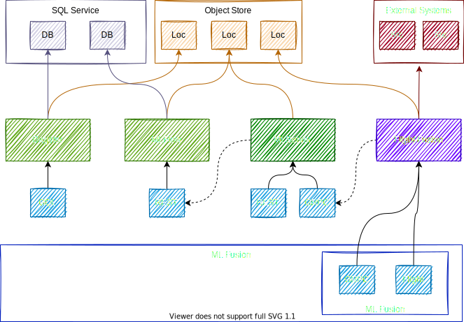

# ML Fusion

The Ml Fusion services work together to enable a seamless data science workflow. In this we are
opinionated about the best way to use certain technologies to unlock advanced interactions
and more deeply integrate the different capabilities. The main idea is to accompany the entire
journey, from raw data to model deployed into production without the need to use different
APIs and minimal code changes along the way.

- Working locally
- Testing
- Deployment

## Features

### Read data

- read complete dataset
- query dataset
- join multiple datasets

### Write data

- write into delta tables
- write into parquet tables

## Client

- list available datasets
- register new datasets
- get return messages
- drop dataset
- ...
